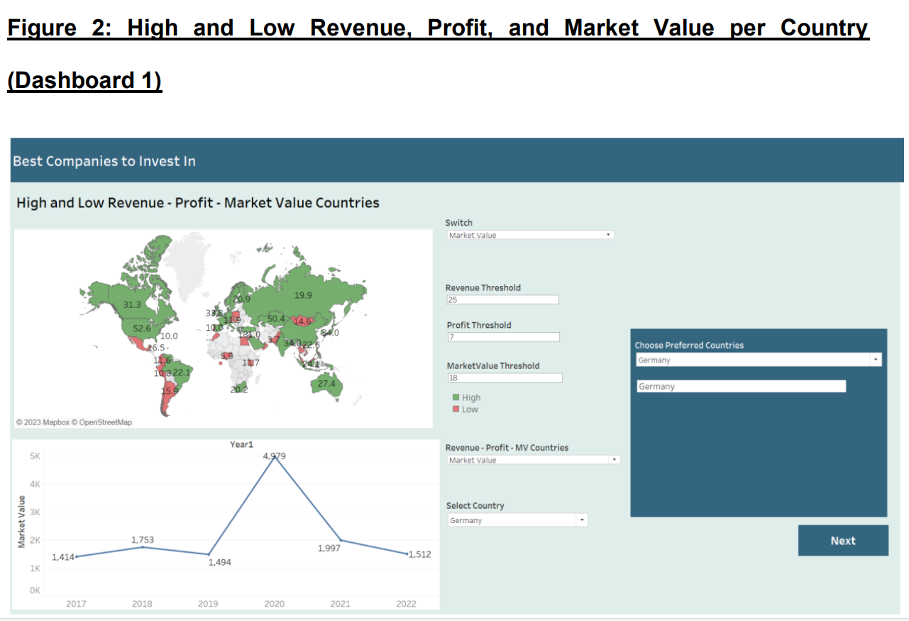
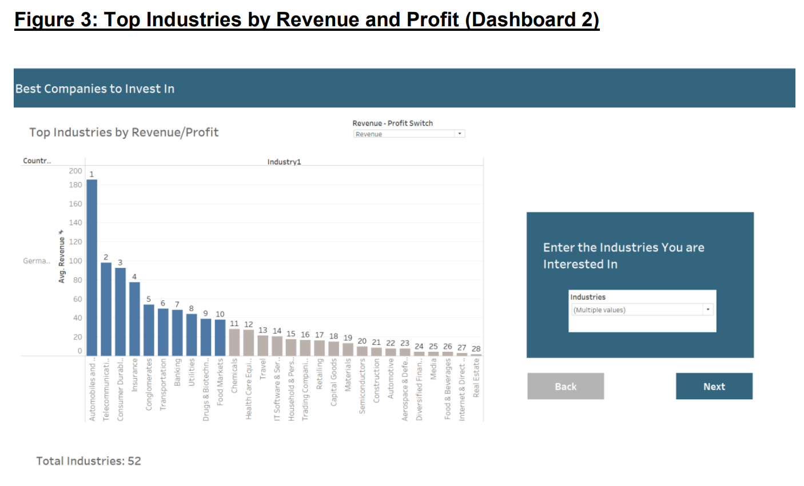
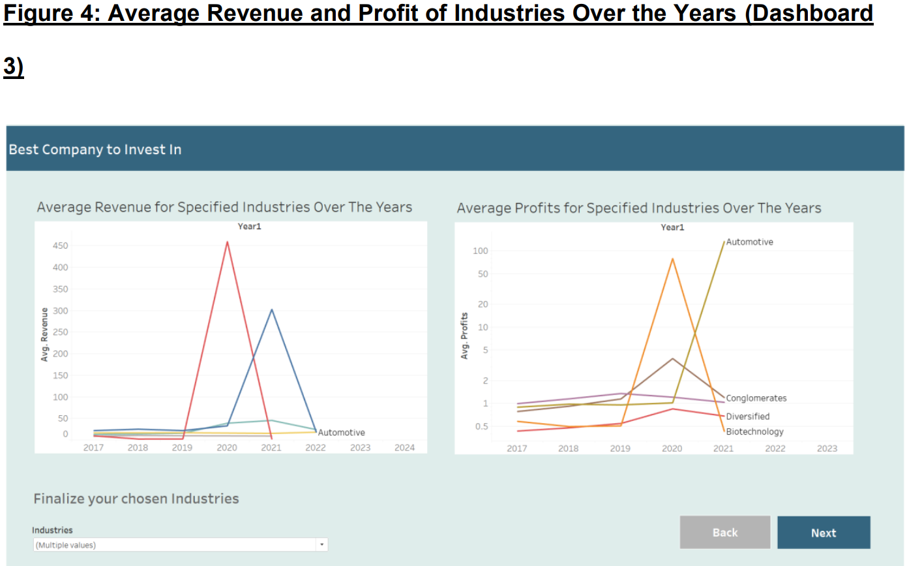
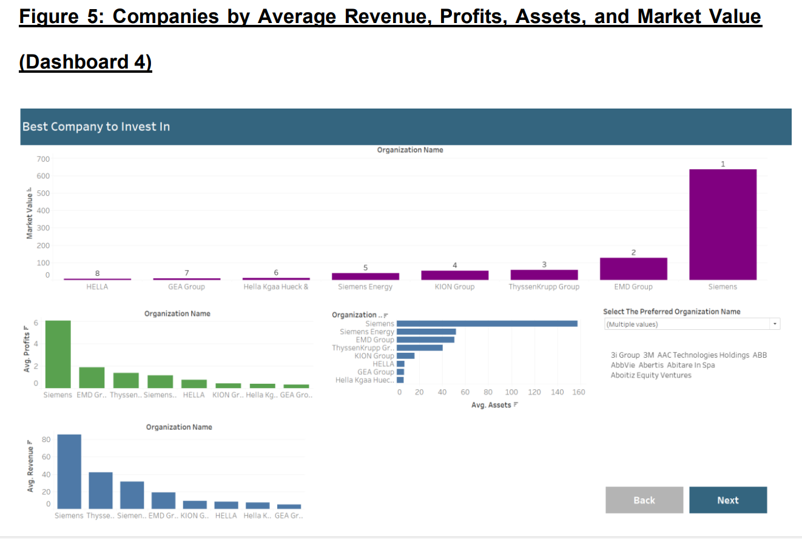
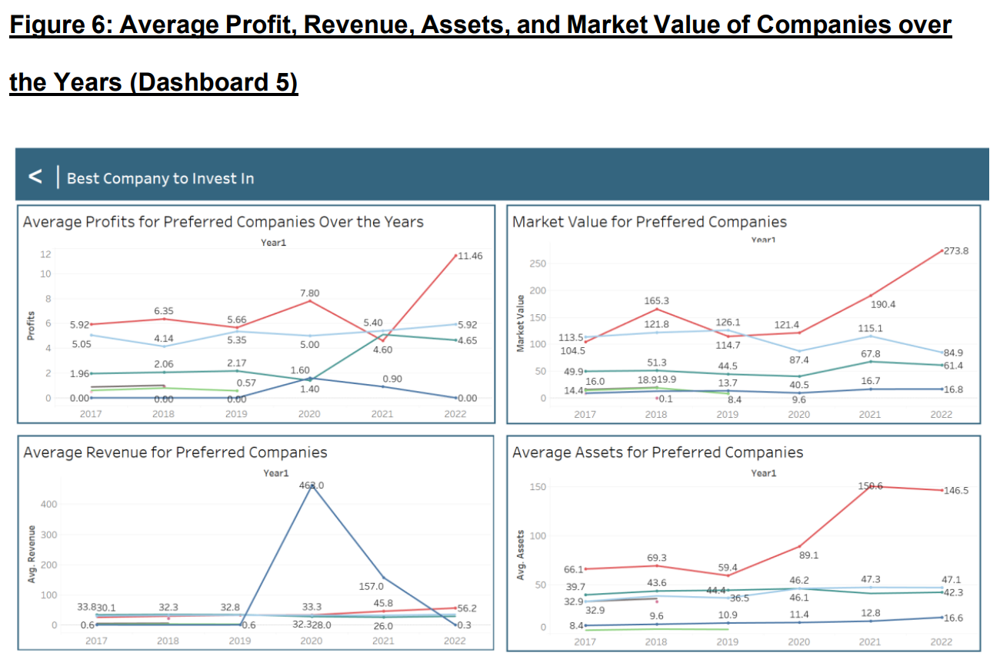
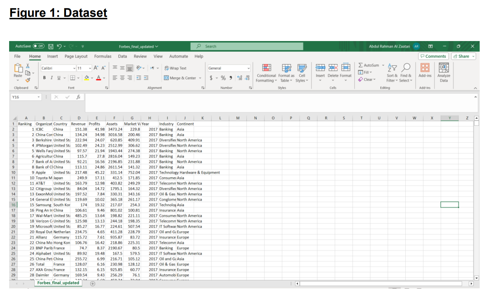

# Forbes Top Companies Visualization Dashboard 📊

## Description 📋

This repository contains a comprehensive data visualization dashboard designed to explore and make sense of the Forbes list of top companies from 2017 to 2022. In an age of abundant data, our dashboard serves as a powerful tool to transform raw data into visual stories, providing clear insights into the global corporate landscape. We utilize Tableau, a renowned data visualization platform, to handle and present the data effectively. 🚀

## Table of Contents 📄

1. [Introduction](#Introduction 👋)
2. [Tools for Visualization](#tools-for-visualization)
3. [Dataset Information](#dataset-information)
4. [Business Questions & Dashboards](#business-questions--dashboards)
5. [Figures](#figures)

## Introduction 👋

Welcome to the comprehensive project designed to navigate and make sense of the extensive data from the Forbes list of top companies. In an era where data is abundant, the ability to interpret it effectively is crucial for strategic decision-making. Our dashboard serves as a powerful tool in this regard, transforming raw data into visual stories that provide clear insights into the global corporate landscape.

The Forbes top companies’ dataset, which forms the backbone of this dashboard, contains a wealth of information about companies that lead the world in revenue, profits, market value, and influence. Data visualization is not just about presenting data; it's about uncovering the truths hidden within numbers and making them accessible to all stakeholders. It empowers users to detect patterns, trends, and outliers quickly, which would be less apparent in spreadsheets or reports.

Whether you're a business analyst, an investor, a policymaker, or simply a data enthusiast, this dashboard is designed to cater to your curiosity and provide you with the answers you need. 📈

In the following sections, we will guide you through the functionalities of the dashboard, the questions it can answer, and how to interpret its findings.

## Tools for Visualization 🔧

For the visualization and analysis of the Forbes top companies’ data, we have chosen Tableau, a platform renowned for its extensive data visualization capabilities. Tableau stands out in the realm of business intelligence tools for its intuitive design, allowing users to create complex data visualizations without the need for extensive technical skills.

Tableau's strength lies in its ability to handle large volumes of data with ease, rendering visualizations that are not only compelling but also interactive. Users can filter, sort, and drill down into the specifics of the data.

Moreover, Tableau's dashboard functionality brings together multiple visualizations into a single cohesive narrative. This integration is crucial for comparing different data points, providing a holistic view of the corporate landscape as depicted by Forbes' rankings.

Tableau was not just a choice but a strategic asset for our dashboard project. It has enabled us to transform the static data from Forbes into a dynamic exploration tool. 📊

## Dataset Information 📂

### Merging Multiple Datasets

- The project began with the integration of five distinct datasets. This task demanded precise alignment of similar columns, ensuring uniformity in naming conventions, and the consistency of data types across all datasets.
- Managing discrepancies in data entries and resolving conflicts in data values were crucial steps in the merging process.

### Standardizing Units of Measure

- A significant challenge involved standardizing units of measure, particularly for financial metrics like profits and revenue. This task required converting all financial data to a consistent unit, ensuring uniformity throughout the dataset.
- Standardization was essential for enabling accurate financial comparisons and data aggregation.

### Handling Missing Values

- The dataset initially had approximately 6,000 missing values in the 'Industry' column. A strategic approach was taken to fill in these gaps:
  - Where possible, industries were inferred from company names (e.g., companies with 'Bank' in their name were classified under 'Banking').
  - For recurring companies across different years, industry data from one year was replicated in subsequent years.
  - Remaining missing values were filled either manually by searching about the company.

### Adding the Continent Data

- Continent information was appended to each company's record, enhancing the dataset's geographical analysis capabilities. This involved associating each country with its respective continent.
- This addition enabled more detailed analysis, such as comparing company performance across different continents.

### Correcting Industry Classifications

- Industry classifications were standardized for consistency. For instance, 'Food and Beverages' entries were updated to 'Food and Drinks'.
- This harmonization ensured accurate grouping of companies within industries, facilitating precise industry-level analysis.

### Resolving Ranking Discrepancies

- Issues with duplicate or missing rankings within the dataset were addressed. Unique rankings were reassigned to each company, maintaining the ranking system's integrity.

## Business Questions & Dashboards 📈

The dashboards were crafted to address a critical scenario: the investors are interested in investing in a specific company sought the insights of a data analyst to navigate this decision. Each dashboard features diverse visualizations strategically designed to answer specific business questions addressing the investment dilemma.

### Dashboard 1: High and Low Revenue, Profit, and Market Value per Country

Beginning with the scenario, the first dashboard is presented to influence the investors’ choice of countries. This dashboard is meant to give insight on the average profit, revenue, and market value of the countries, answering the question: “What are the top countries in terms of revenue, profits, and market value?” The goal here is to pinpoint the leading financial powerhouses in the global market, with the help of a map which displays in green countries with high values for those metrics, and in red for countries with low value for those metrics. This dashboard also answers the question: “How did the average revenue, profit, and market value of a country’s company evolve over time?” This is useful to pinpoint if the countries selected are experiencing economic growth or not, and is displayed in the form of a line graph, with the years as the x-axis, and the metric of interest in the y-axis. This gives an idea on where in the world should potential investors put their money in.

Not only does the dashboard let the investor select which metrics they want the graph to visualize, it gives business-minded people the ability to set their own threshold for what they consider high or low revenue, profit, and market, as well as selecting the countries for which they want to see the annual changes in those metrics.

After analyzing the data, possible stakeholders can select the countries they want more information on. They will then click “next” and be taken to the next dashboard.

*Figure 2: High and Low Revenue, Profit, and Market Value per Country (Dashboard 1)*

### Dashboard 2: Top Industries by Revenue and Profit

After the selection of the country the investor wishes to invest in, they are taken to another dashboard, where the questions of: “How do different industries in the chosen country compare in terms of average profit and revenue?” Stakeholders can thus dive into sector-specific performances to gauge industries' health and profitability, with the help of a bar graph, with the industry of interest in the x-axis, and the average profit/revenue in the y-axis.

They will then select which industries they would like to explore better.

*Figure 3: Top Industries by Revenue and Profit (Dashboard 2)*

### Dashboard 3: Average Revenue and Profit of Industries Over the Years

After the Industries' initial selection is complete, users will be taken to another dashboard, that will answer the questions: “How does the average revenue in selected industries evolve over time?” and “How does the average profit in selected industries evolve over time?” Investors will thus be able to tailor their picks more, leaving out industries that are not growing, and picking only those that will most likely be fruitful to them. The graphs will be made possible by two-line graphs, one for each measure, that have the year in the x-axis and the average value of the metrics in the y-axis.

They will be able to finalize their industries pick, leaving off industries that are not growing and adding industries that seem to have potential.

*Figure 4: Average Revenue and Profit of Industries Over the Years (Dashboard 3)*

### Dashboard 4: Companies by Average Revenue, Profits, Assets, and Market Value

After selecting the countries and industries that interested them, investors will have the opportunity to see how the companies in those selected countries and industries are faring. It will answer the questions: “What are the companies with the highest average revenue, profits, and assets?” and “What is the Market Value of all the companies?” Possessing this information will make it possible for investors to decide in what company to put their money in. This visualization takes the form of multiple ordered bar graphs, displaying the measure of interest for each company.

The user will finally be able to select the companies that they are interested in and will be taken to the final dashboard.

*Figure 5: Companies by Average Revenue, Profits, Assets, and Market Value (Dashboard 4)*

### Dashboard 5: Average Profit, Revenue, Assets, and Market Value of Companies over the Years

Finally, the now hopefully more informed investors will be able to analyze how the profit, revenue, assets, and market value of the companies of interest have evolved, answering the question: “How have the different companies of interest evolved over the years?” This will give potential stakeholders an idea of which companies are a good bet for investments, with the help of four-line graphs, one for each of those measure, displaying that information.

*Figure 6: Average Profit, Revenue, Assets, and Market Value of Companies over the Years (Dashboard 5)*

This project aims to assist users in making informed investment decisions by providing a visually-rich exploration of Forbes' top companies' data. Whether you're an investor seeking financial insights or an analyst interested in industry trends, this dashboard will guide you through the data-driven journey.

## Figures 🖼️

Here are the figures related to the project for reference:

- Figure 1: Dataset 
- Figure 2: High and Low Revenue, Profit, and Market Value per Country (Dashboard 1) 
- Figure 3: Top Industries by Revenue and Profit (Dashboard 2) 
- Figure 4: Average Revenue and Profit of Industries Over the Years (Dashboard 3) 
- Figure 5: Companies by Average Revenue, Profits, Assets, and Market Value (Dashboard 4) 
- Figure 6: Average Profit, Revenue, Assets, and Market Value of Companies over the Years (Dashboard 5) 

